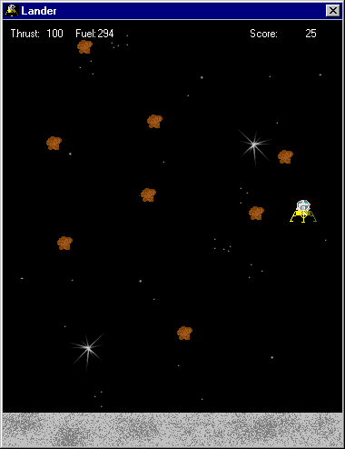



## Lander

### Description

This is a simple game that a beginner could learn from. There are no api calls in it. It is all pure visual basic code. The collision detection is not 100% perfect but works pretty well. All of this code is 100% from me and none was taken from PSC or any other source. Feel free to make NICE comments and vote if you like it. Hope you all enjoy it!!
 
### More Info
 

             |
---                |---
**Submitted On**   |2001-01-25 16:33:04
**By**             |[Element\-X Software Productions](https://github.com/Planet-Source-Code/PSCIndex/blob/master/ByAuthor/element-x-software-productions.md)
**Level**          |Beginner
**User Rating**    |4.3 (13 globes from 3 users)
**Compatibility**  |VB 6\.0
**Category**       |[Games](https://github.com/Planet-Source-Code/PSCIndex/blob/master/ByCategory/games__1-38.md)
**World**          |[Visual Basic](https://github.com/Planet-Source-Code/PSCIndex/blob/master/ByWorld/visual-basic.md)
**Archive File**   |[CODE\_UPLOAD141701252001\.zip](https://github.com/Planet-Source-Code/element-x-software-productions-lander__1-14722/archive/master.zip)

